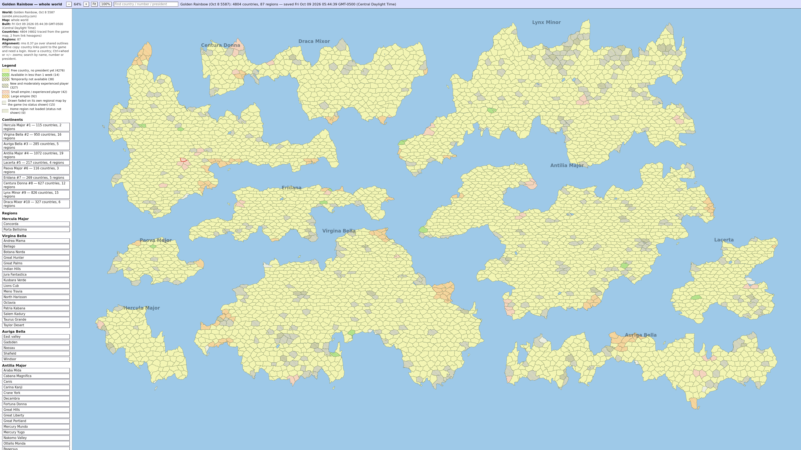

# Simcountry QoL Scripts

Browser userscripts that take the busywork out of [Simcountry](https://www.simcountry.com/) — the long-running browser MMO where you run countries, enterprises, trade, and wars across several persistent worlds.

This repo is a small toolkit for people who already play. It does not replace the game. It just makes a few of the most tedious pages easier to live with.

[](LICENSE)
[](https://www.tampermonkey.net/)
[](https://www.simcountry.com/)

| Script | Version | What it does |
| --- | --- | --- |
| [Loan Offers.js](scripts/Loan%20Offers.js) | 1.5.0 | Sort, filter, highlight, total, and batch-submit loan offers |
| [Order Strategies](scripts/Order%20Strategies) | 1.4.0 | Select, filter, preset, and snapshot stock-order strategies |
| [Salary Tweaks](scripts/Salary%20Tweaks) | 1.1.0 | Select, filter, and bulk-set state corporation salaries |
| [Portal.js](scripts/Portal.js) | 1.3.0 | Reorder countries/enterprises and flick the news ticker |
| [Simcountry Cash Log — endless, sort, filter](scripts/Simcountry%20Cash%20Log%20%E2%80%94%20endless%2C%20sort%2C%20filter) | 1.6.0 | Sort, filter, cap, and export Cash Log plus sales and purchase logs |
| [War Casualty Bookmarklet](3rd%20Party/War%20Casualty%20Bookmarklet.txt) | 3rd party | Summarize war losses from a battle report page |

> Unofficial. Not affiliated with Simcountry or its operators. Use at your own risk, and stay inside the game's rules.

---

## Install

1. Install [Tampermonkey](https://www.tampermonkey.net/) for your browser.
2. Open a script file from this repo (or the raw URL).
3. Tampermonkey should offer **Install**. If it does not, create a new script and paste the file in.
4. Visit the matching Simcountry page while logged in. The extra UI appears on that page only.

Raw files:

- `https://github.com/WalkingGlitch/Simcountry/raw/main/scripts/Loan%20Offers.js`
- `https://github.com/WalkingGlitch/Simcountry/raw/main/scripts/Order%20Strategies`
- `https://github.com/WalkingGlitch/Simcountry/raw/main/scripts/Salary%20Tweaks`
- `https://github.com/WalkingGlitch/Simcountry/raw/main/scripts/Portal.js`
- `https://github.com/WalkingGlitch/Simcountry/raw/main/scripts/Simcountry%20Cash%20Log%20%E2%80%94%20endless%2C%20sort%2C%20filter`

Preferences are stored in Tampermonkey / `localStorage`. They stay on your machine.

---

## Loan Offers Toolkit

**File:** [`Loan Offers.js`](scripts/Loan%20Offers.js)  
**Author:** TheWalkingGlitch  
**Runs on:** country and enterprise loan-offer pages (`loanmyoff`, `eloanmyoff`, `cloanmyoff`, and close cousins)

The stock loan page is a form plus a flat list. This script keeps the native submit path and layers a small toolkit on top of it.


*Loan Offers toolkit on the loan-offer page.*

### Features

- **Click-to-sort** the Offered Loans table by amount, period, or interest
- **Filter** the list as you type
- **Highlight** open offers above a threshold (default `1T`, color `#b8860b`, both editable)
- **Totals** for what is currently visible
- **Repeat submit** — post the same offer 1–50 times, with a short delay and a cancelable progress banner
- Remembers last amount, period, and repeat count
- Copy visible rows to the clipboard as text / CSV
- Sticky table headers so the columns do not vanish when you scroll
- Understands compact Simcountry numbers (`K` / `M` / `B` / `T` / `Q`)

Interest rates stay world-controlled. The script only fills amount, period, and how many identical offers to send.

---

## Order Strategy Toolbox

**File:** [`Order Strategies`](scripts/Order%20Strategies) *(no `.js` extension; Tampermonkey still accepts it)*  
**Author:** TheWalkingGlitch  
**Runs on:** Country → Trade → **Order Strategies** (`form name="fSOS"`)

Stock order strategies are a long grid of products. The toolbox is a floating panel on that page. Selection is a checkbox to the left of each industry icon — sorting the list does not change what is checked.

Screenshot: none yet.

### Features

- Checkbox-select products, then apply values only to the checked set
- Search, category chips, and field filters (quality, low-water, order qty, OS mode)
- Reorder the live list without touching the site's save button
- Bulk fill **low-water**, **order quantity**, and **quality** (clamped to 120–330)
- Quality offset (`+` / `−`) for nudging a selection
- Modes: auto, months, units, or off — auto falls back when a product has no months strategy
- Presets:
  - Economy `3 / 14 @ 120`
  - Stockpile `8 / 24 @ 160`
  - Military `6 / 18` at quality cap
  - Civilian `3 / 14 @ 120`
- Named **revisions**: save the current page (or only checked rows), restore later
- Restore matches by product id first, then name + category, then unique name. New products on the page are left alone; missing saved ids are skipped.
- Draggable, collapsible panel

Nothing is sent until you hit the site's own save button.

---

## State Salary Toolbox

**File:** [`Salary Tweaks`](scripts/Salary%20Tweaks) *(no `.js` extension; Tampermonkey still accepts it)*  
**Userscript name:** Simcountry State Salary Toolbox  
**Author:** TheWalkingGlitch  
**Runs on:** Country → Corporations → **Salary Levels** (`statecmpsalaries` / `stateCmpSalariesSubmit`)

Same idea as the order-strategy toolbox, pointed at the state salary grid. Checkboxes select corporations. Sorting and filters only reflow the live list. Apply writes the form fields; the site button **Set Salary Changes** is what actually saves.


*Salary Tweaks toolbox on the salary-levels page.*

### Features

- Checkbox to the left of each product icon; checked rows highlight
- Search by corporation name, plus category and product-type dropdowns
- Range filters for current salary, target, welfare index, and hiring
- Filter by strategy mode (target index vs increase)
- Selection helpers: check visible, uncheck all, invert visible, check military / industry / civilian
- Bulk apply to the checked set:
  - **Target index** (default 300) or **Increase %**
  - **Target 300** shortcut
  - **Target = current** copies each corp's current salary into its target
- Covers State Corporations, National Industries, and Country Controlled / Public Corporations on the same page
- Named **revisions**: save all or only checked rows, restore later
- Restore matches by corporation id first, then name + product, then unique name. Corps added after the snapshot are left alone.
- Draggable, collapsible panel

Nothing is sent until you hit **Set Salary Changes**.

---

## Desktop Enhancer (Portal.js)

**File:** [`Portal.js`](scripts/Portal.js)  
**Userscript name:** Simcountry Desktop Enhancer  
**Author:** TheWalkingGlitch  
**Runs on:** the portal widgets *My Countries* / *My Enterprises*, and any page that still has the scrolling news ticker

Drag the country and enterprise tiles into the order you actually use, or pick a named sort. The ticker can be grabbed and flung instead of only auto-scrolling.


*Portal desktop enhancer on the portal page.*

### Widget features

- Drag-reorder tiles on **My Countries** and **My Enterprises**
- Sort dropdowns:
  - Custom (drag order)
  - Name A → Z / Z → A
  - World, then name
  - World Z → A, then name
  - Page default
- Reset button restores the page's original order
- New countries or enterprises get appended to a saved custom order instead of wiping it
- Worlds are recognized from the usual hosts (Kebir Blue, Fearless Blue, White Giant, Golden Rainbow, Little Upsilon, Tiny Atlas)

### Ticker features

- Click and drag the ticker strip; release to let it coast
- Native auto-scroll pauses while you are flicking it, then resumes after a short idle
- **Ticker** button opens motion settings: enabled, acceleration, motion factor, friction, max speed, invert drag
- Defaults restore from that same panel

Order and ticker prefs live in `localStorage` under `scEnhancer.v1`. From the console: `scEnhancer.reset()` clears them and reloads.

---

## Cash Log (endless, sort, filter)

**File:** [`Simcountry Cash Log — endless, sort, filter`](scripts/Simcountry%20Cash%20Log%20%E2%80%94%20endless%2C%20sort%2C%20filter) *(no `.js` extension; Tampermonkey still accepts it)*  
**Userscript name:** Simcountry Cash Log — endless, sort, filter  
**Author:** TheWalkingGlitch  
**Runs on:** Country Finance → **Cash Log** (`miDesktopTab=6`, applet `cfinance`), plus Country trade **Recent Sales** (`tsl`) and **Recent Purchases** (`tbl`). The cash tab leaves the address bar alone; the trade pages are full pages.

Cash Log is not its own page. The script reads that applet payload, drops empty spacer and history-icon columns, and paints a second table of the text columns. Sales and purchase pages get the same panel on their own tables. It does not invent page parameters, and it leaves profit & loss and year-to-date alone.


*Cash Log toolkit on the cash-log page.*

### Features

- **Click-to-sort** the loaded columns
- **Filter** any column as you type
- Cash Log flow filter: all, income, or spending (income in green, spending in red). Sales and purchase logs do not show that dropdown; purchases are signed as spending and sales as income
- Game-month filter, with optional month-break rows
- Row cap (on by default, 1000) so the crawl stops
- **Load older** on Cash Log follows an older-page link in the cash-log response only. It does not guess `miFrom` / `miPageStartPos`
- **Load older** on sales and purchases follows the page Next control (`miTradeTransaction` and `next`), not a guessed cursor
- **Export CSV** of the visible rows (adds Month and signed amount)
- Reset sort
- Sticky headers; a hover tip shows text cut off by the column
- Leaves profit & loss, year-to-date, and the other finance tables on that applet alone

The older-page fetch goes to the game, and only when that next link is already in the response. It stops at the row cap.

---

## War Casualty Bookmarklet (3rd party)

**File:** [`3rd Party/War Casualty Bookmarklet.txt`](3rd%20Party/War%20Casualty%20Bookmarklet.txt)  
**Author:** hymy — published here with permission from the Simcountry Discord

A bookmarklet, not a Tampermonkey script. It reads the attacker / defender report blocks on a war page, totals equipment losses plus soldiers killed and wounded, and opens a compact comparison table in a new window.

Screenshot: none yet.

### Install

1. Open the text file and copy the single `javascript:...` line.
2. Create a bookmark in your browser and paste that line as the URL.
3. Open a Simcountry war / battle report page and click the bookmark.

---

## World maps

**Files:** [`World Maps/`](World%20Maps) — one self-contained HTML page per world, generator `Simcountry shaded world map 3.0.0`  
**Author:** TheWalkingGlitch  
**Runs on:** your browser, offline. These are saved snapshots, not a userscript, and they do not call the game when you open them.

Each file is a shaded whole-world map from the morning of 9 Oct 2026 (Central). Download the HTML and open it locally. The page draws the map, a zoom bar, and a side panel. Search matches country name, country number, or president. Continent and region buttons jump the view. Hover a country for the tip. Dashed boxes are regions placed approximately.



*Shaded world map viewer on a saved Simcountry world render.*

### Snapshots

- [Fearless Blue](World%20Maps/simcountry-fearless-blue-world-20261009-0556.html) — `sim02`, saved 05:56
- [White Giant](World%20Maps/simcountry-white-giant-world-20261009-0549.html) — `sim03`, saved 05:49
- [Golden Rainbow](World%20Maps/simcountry-golden-rainbow-world-20261009-0544.html) — `sim04`, saved 05:44
- [Kebir Blue](World%20Maps/simcountry-kebir-blue-world-20261009-0600.html) — `sim01`, saved 06:00
- [Little Upsilon](World%20Maps/simcountry-little-upsilon-world-20261009-0604.html) — `sim05`, saved 06:04
- [Tiny Atlas](World%20Maps/simcountry-tiny-atlas-world-20261009-0607.html) — `sim06`, saved 06:07

### How to use

- Download the HTML file (GitHub's raw view is fine) and open it in a browser. No server, no login.
- **− / +**, **Fit**, and **100%** set the zoom. Ctrl+wheel does the same.
- The search box is "Find country / number / president".
- The side panel lists world, game date, host, build time, how many countries were traced, and regions. Continents and regions are buttons.
- The status line is the snapshot: world, in-game date, country and region counts, and when it was saved.
- These pages are finished outputs. See License. They are not covered by the Unlicense.

---

## Repository layout

```
Simcountry/
├── scripts/
│   ├── Loan Offers.js
│   ├── Order Strategies
│   ├── Portal.js
│   ├── Salary Tweaks
│   └── Simcountry Cash Log — endless, sort, filter
├── readmescreenshots/
│   ├── LoanOffersjs Example Screenshot.png
│   ├── Portaljs Example Screenshot.png
│   ├── Salary Toolbox SS.png
│   ├── Screenshot_20261009_164146.png
│   ├── SS Cash Log.png
│   └── placeholder
├── World Maps/
│   ├── placeholder
│   ├── simcountry-fearless-blue-world-20261009-0556.html
│   ├── simcountry-golden-rainbow-world-20261009-0544.html
│   ├── simcountry-kebir-blue-world-20261009-0600.html
│   ├── simcountry-little-upsilon-world-20261009-0604.html
│   ├── simcountry-tiny-atlas-world-20261009-0607.html
│   └── simcountry-white-giant-world-20261009-0549.html
├── 3rd Party/
│   └── War Casualty Bookmarklet.txt
├── External Tools/
│   └── csv-viewer.html
├── LICENSE
└── README.md
```

---

## Notes and limits

- These scripts scrape and click the live site. A game update can break them overnight.
- They are client-side only. They do not talk to a third-party server.
- First-party userscripts now live under `scripts/`. Raw install URLs changed with that move. Existing Tampermonkey copies need the new raw link (or a reinstall from the file) if they were pointed at the old root path.
- Batch loan submits reload the offer page once per offer, with a delay. Do not walk away from a 50-offer job if you care about the result.
- Order-strategy and salary revisions live in userscript storage. Export nothing you cannot rebuild.
- Portal sort order is local to that browser. It will not follow you to another machine.
- Cash Log paints on the finance cash tab. The same script also paints on trade sales (`tsl`) and purchases (`tbl`). Load older follows a next link already in the response — the cash-log applet link, or the trade Next control — and stops at the row cap (default 1000). It does not invent page parameters.
- `External Tools/csv-viewer.html` opens a local CSV in the browser. Caps, sort, filter, and find/replace stay on that page. The original file is not changed until you export.
- World-map HTML files are offline snapshots under `World Maps/`. Opening one does not fetch the game. `World Maps/` has no license file of its own, so those renders stay proprietary.
- Unofficial tools can sit in a grey area of a game's rules. If Simcountry says no, stop.

---

## License

The Unlicense covers the tools in this repo: the userscripts, the bookmarklet, and `External Tools/csv-viewer.html`. Copy, modify, ship, or ignore those with or without credit. They are provided **as is**, without warranty of any kind. They may work. They may not. They will not reimburse you for a bad loan book.

That grant stops at the tools. [LICENSE](LICENSE) now says finished outputs posted here are not automatically Unlicense. Mapping outputs, renders, applets, and web pages — including the shaded world maps — are proprietary unless a license file sits in their directory. `World Maps/` has no such file. Do not copy those renders out as if they were public domain.

---

## Contributing

Issues and PRs are welcome, especially:

- Game-page selectors that drifted after a Simcountry update
- Safer defaults for repeat-submit and quality clamps

Keep changes scoped to one page family at a time. The game's markup is old and specific; broad refactors tend to miss a country vs enterprise variant.
